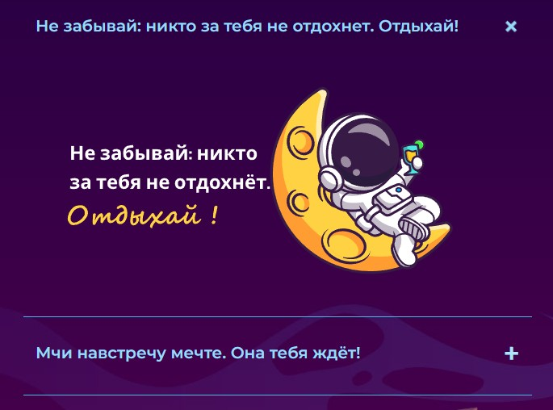
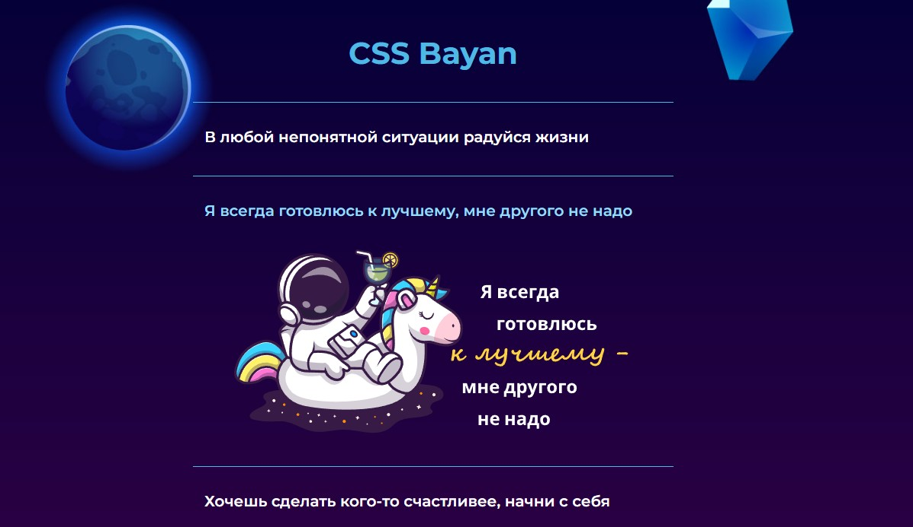

# CSS Bayan

Учебный проект курса [**_"JavaScript/Front-end"_**](https://rs.school/js/). Aккордеон реализованный только с помощью HTML и CSS.

## **Функциональные осбенности**

1. Компонент аккордеона отцентрирован на экране с одинаковыми отступами слева и справа.
2. Внедрен адаптивный дизайн. Аккордеон корректно отображается на мобильном телефоне 320х568, планшете 820х1180, десктопе 1920х1080.
3. Размер шрифта меняется на каждом устройстве (мобильном, планшетном, настольном).
4. Макет аккардеона включает изображение мема, текст и иконку.
5. Присутствует значок состояния развернутого/свернутого элемента.
6. Плавные переходы применяются для смены мемов и смены значков.
7. Вся строка (текст, значок и изображение мема) кликабельна.
8. Эффект курсора над мемами (наведение) существует только для устройств, поддерживающих наведение. [MDN Note](https://developer.mozilla.org/en-US/docs/Web/CSS/:hover), [MDN hover in media queries](https://developer.mozilla.org/en-US/docs/Web/CSS/@media/hover)
9. Курсор изменяется, когда он наведен на аккордеон.
10. Изначально выбран первый мем.
11. Выбранный мем всегда развернут.
12. Выбор другого мема делает предыдущий невыбранным (и свернутым).
13. Нажатие на мем делает его выбранным.
14. Реализованы визуальные эффекты при наведении курсора на мемы, при наведении мыши на мем (момент наведения мыши — для активного эффекта):
    * Когда курсор находится за пределами мемов:
      * значки состояния развернутого/свернутого элемента должны быть скрыты (Примечание: только для устройств, поддерживающих наведение; для устройств с тачпадом значки всегда видны);
      * цвет текста развернутого элемента отличается от цвета текста свернутых элементов.
    * Когда курсор наведен на мемы:
      * становятся видимыми все значки всех предметов;
      * цвет текста свернутых элементов меняется на цвет текста развернутого элемента, цвет текста развернутого элемента не меняется;
      * мем, по которому движется курсор, расширяется, иконка этого мема изменится на развернутую иконку;
      * когда курсор выходит за пределы мема, элемент сворачивается, развернутый значок меняется на свернутый значок; выбранный/выделенный мем не должен стать свернутым.
    * Когда пользователь нажимает на элемент-мем (момент нажатия мыши — для активного эффекта):
      * меняется цвет текста и цвет значков;
      * меняется непрозрачность элементов

## **Технические требования**
  * Запрещено использовать CSS-фреймворки (bootstrap, Foundation и т. д.);
  * Запрещено использовать для реализации библиотеки JavaScript и npm;
  * Запрещено использовать инструменты предварительной обработки CSS (необходимо использовать чистый CSS);
  * Аккордеон должен корректно работать в Chrome;
  * Разрешается использовать дополнительный контент, например, h1, нижний колонтитул, заголовок... для увеличения содержания страницы;
  * Разрешено использовать gif изображения;
  * Разрешено использовать px для медиа-запросов;
  * Разрешено использовать reset.css и normalize.css

## **Соблюденные критерии**
  * Компонент аккордеона располагается по центру экрана с одинаковыми отступами слева и справа
  * Присутствуют иконки, тексты мемов и изображения мемов
  * Размещение мема, значков и текста мема соответствуют требованиям
  * Сделано плавное изменение (переход) изображений и иконок мема
  * Существует адаптивный дизайн с тремя точками останова для мобильных устройств, планшетов и настольных компьютеров. Аккордеон отображается правильно на mobile 320x568, tablet 820x1180, desktop 1920×1080.
  * Реализованы все визуальные эффекты при наведении курсора на мемы, при наведении мыши на мем и при выборе мема
  * Вся строка (текст, иконка и изображение мема) кликабельна
  * Эффект курсора над мемами (наведение) существует только для устройств, поддерживающих наведение
  * Курсор при наведении на строки аккардеона меняется
  * Используются только гибкие размеры rem, em, %, vh, vw, frи т. д... Аккордеон отзывчивый
  * Все блоки/части аккордеона находятся в базовом потоке элементов dom. Все элементы не позиционируются с помощью top, left, right, bottom. floatне используется. Значение positionвсего static
  * Псевдоэлементы не используются
  * Изначально первый мем должен быть расширен
  * Размер шрифта меняется на каждом устройстве (мобильном, планшетном, настольном) 

## **Стек технологий**

## [**Демо**](https://alekseeva-t-v.github.io/todo/)
